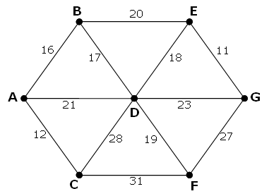

<escape><!-- more --></escape>
    
# Project Euler 107
## 题目
### Minimal network


The following undirected network consists of seven vertices and twelve edges with a total weight of 243.



The same network can be represented by the matrix below.

||**A**|**B**|**C**|**D**|**E**|**F**|**G**|
|-|-|-|-|-|-|-|-|
|**A**|-|$16$|$12$|$21$|-|-|-|
|**B**|$16$|-|-|$17$|$20$|-|-|
|**C**|$12$|-|-|$28$|-|$31$|-|
|**D**|$21$|$17$|$28$|-|$18$|$19$|$23$|
|**E**|-|$20$|-|$18$|-|-|$11$|
|**F**|-|-|$31$|$19$|-|-|$27$|
|**G**|-|-|-|$23$|$11$|$27$|-|

However, it is possible to optimise the network by removing some edges and still ensure that all points on the network remain connected. The network which achieves the maximum saving is shown below. It has a weight of 93, representing a saving of 243 ? 93 = 150 from the original network.


Using [network.txt](../resources/p107_network.txt) (right click and ‘Save Link/Target As\dots’), a 6K text file containing a network with forty vertices, and given in matrix form, find the maximum saving which can be achieved by removing redundant edges whilst ensuring that the network remains connected.


## 解决方案

这是图论中[最小生成树(Minimum spanning tree)](https://en.wikipedia.org/wiki/Minimum_spanning_tree)中的问题。常见的使用算法有[Kruskal](https://en.wikipedia.org/wiki/Kruskal%27s_algorithm)和[Prim](https://en.wikipedia.org/wiki/Prim%27s_algorithm)算法。

Kruskal算法主要是基于贪心思想，使用[并查集](https://en.wikipedia.org/wiki/Disjoint-set_data_structure)实现的，维基百科上的伪代码如下：

```
algorithm Kruskal(G) is
    F:= ∅
    for each v ∈ G.V do
        MAKE-SET(v)
    for each (u, v) in G.E ordered by weight(u, v), increasing do
        if FIND-SET(u) ≠ FIND-SET(v) then
            F:= F ∪ {(u, v)} ∪ {(v, u)}
            UNION(FIND-SET(u), FIND-SET(v))
    return F
```

根据边权大小的顺序，从小到大遍历每条边。如果边两侧的点不在一个集合中，那么这条边是需要的，并将这两个集合合并；否则跳过这条边。

本代码使用networkx的minimum_spanning_tree函数，直接给出一个最小生成树方案。

## 代码


```py
import networkx as nx

G = nx.Graph()
ls = open('p107_network.txt', 'r').readlines()
n = len(ls)
ans = 0
for i in range(n):
    lt = ls[i].split(',')
    for j in range(i):
        if lt[j][0] == '-':
            continue
        w = int(lt[j])
        ans += w
        G.add_edge(i, j, weight=w)
T = nx.minimum_spanning_tree(G)
for u, v in T.edges:
    ans -= T.get_edge_data(u, v)['weight']
print(ans)
```

```py
ls = open('p107_network.txt', 'r').readlines()
n = len(ls)
fa = [i for i in range(n)]


def find(x: int):
    if x == fa[x]:
        return x
    else:
        fa[x] = find(fa[x])
        return fa[x]


def merge(x: int, y: int):
    fa[find(x)] = find(y)


e = []
ans = 0
for i in range(n):
    lt = ls[i].split(',')
    for j in range(i):
        if lt[j][0] == '-':
            continue
        w = int(lt[j])
        e.append((w, i, j))
        ans += w
e.sort()
for z, x, y in e:
    if find(x) != find(y):
        merge(x, y)
        ans -= z
print(ans)
```