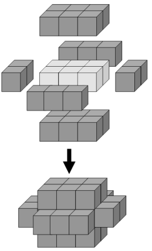

<escape><!-- more --></escape>
    
# Project Euler 126
## 题目
### Cuboid layers
The minimum number of cubes to cover every visible face on a cuboid measuring $3\times2\times1$ is twenty-two.



If we then add a second layer to this solid it would require forty-six cubes to cover every visible face, the third layer would require seventy-eight cubes, and the fourth layer would require one-hundred and eighteen cubes to cover every visible face.

However, the first layer on a cuboid measuring $5\times1\times1$ also requires twenty-two cubes; similarly the first layer on cuboids measuring $5\times3\times1$, $7\times2\times1$, and $11\times1\times1$ all contain forty-six cubes.

We shall define $C(n)$ to represent the number of cuboids that contain $n$ cubes in one of its layers. So $C(22) = 2$, $C(46) = 4$, $C(78) = 5$, and $C(118) = 8$.

It turns out that $154$ is the least value of $n$ for which $C(n) = 10$.

Find the least value of $n$ for which $C(n) = 1000$.


## 解决方案

笔者空间想象能力不太行，因此在这里使用基于广度优先搜索的方式，首先求出每一层所需要的正方体块数。
```C++
# include <bits/stdc++.h>
using namespace std;
const int X=3,Y=2,Z=1,Q=5;
int d[X*3+Q*3+1][Y*3+Q*3+1][Z*3+Q*3+1];
struct P{
    int x,y,z;
};
int dx[6]={-1,1,0,0,0,0},dy[6]={0,0,-1,1,0,0},dz[6]={0,0,0,0,-1,1};
int main(){
    memset(d,-1,sizeof(d));
    queue<P>q;
    for(int i=Q+1;i<=Q+X;i++)
        for(int j=Q+1;j<=Q+Y;j++)
            for(int k=Q+1;k<=Q+Z;k++){
                q.push(P{i,j,k});
                d[i][j][k]=0;
            }
    map<int,int>mp;
    while(!q.empty()){
        P p=q.front();q.pop();
        if(d[p.x][p.y][p.z]==Q) break;
        for(int i=0;i<6;i++){
            int x=p.x+dx[i],y=p.y+dy[i],z=p.z+dz[i];
            if(d[x][y][z]!=-1) continue;
            d[x][y][z]=d[p.x][p.y][p.z]+1;
            q.push(P{x,y,z});
            ++mp[d[x][y][z]];
        }
    }
    for(auto &[k,v]:mp)
        printf("%d %d\n",k,v);
}
```
假设函数$f(x,y,z,n)$是包裹$x\times y\times z$长方体的第$n$层所需要的方块。

通过对上面的代码调整参数$X,Y,Z,Q$，可以发现以下事实：

1. $f(x,y,z,1)=xy+yz+xz$，也就是长方体原本的表面积。
2. 对$f(x,y,z,n)$的参数$n$相邻两项作差，发现：数列$\{f(x,y,z,n+1)-f(x,y,z,n)\}$是一个等差数列，其公差为$8$，首项为$4(x+y+z)$。

由第以上事实可以得到$f(x,y,z,n)$基于参数$n$的递推式：

$$
f(x,y,z,n)=
\left \{\begin{aligned}
  &xy+yz+xz  & & \mathrm{if\quad} n=1 \\
  &f(x,y,z,n-1)+8(n-2)+4(x+y+z)& & \mathrm{else}
\end{aligned}\right.
$$

可以发现，上面的递推式中，$n$最高次数只有一次。因此可以将递推式直接转化为通项公式：

$$
f(x,y,z,n)=2(xy + yz + xz) + 4(x + y + z + n - 2)(n - 1)
$$

剩下的工作，只需要枚举这$4$个参数即可。

不过，由于这里是反过来求的：求一个最小$m$满足$f(x,y,z,n)=m,x\le y\le z$的不同四元组$(x,y,z,n)$个数为$1000$。因此，$m$的上限难以确定，在这里拟定$m$的上限为$1000\times 20$。


## 代码

```C++
# include <bits/stdc++.h>
using namespace std;
const int N=1000;
const int M=N*20;
int c[M+4];
int f(int x,int y,int z,int n){
    return 2*(x*y+y*z+z*x)+4*(x+y+z+n-2)*(n-1);
}
int main(){
    for(int x=1;f(x,x,x,1)<=M;x++)
        for(int y=x;f(x,y,y,1)<=M;y++)
            for(int z=y;f(x,y,z,1)<=M;z++)
                for(int n=1;f(x,y,z,n)<=M;n++)
                    ++c[f(x,y,z,n)];
    int ans=0;
    for(int i=1;i<=M;i++)
        if(c[i]==N){
            ans=i;
            break;
        }
    printf("%d\n",ans);
}

```