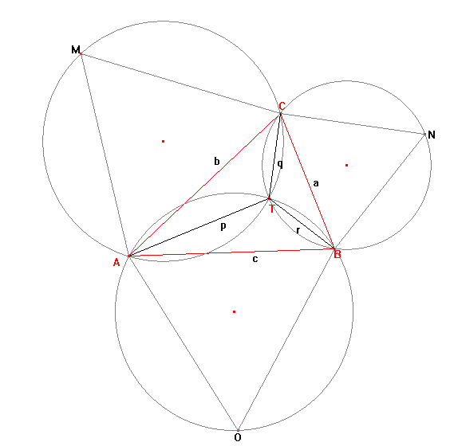

<escape><!-- more --></escape>
    
# Project Euler 143
## 题目
### Investigating the Torricelli point of a triangle


Let $ABC$ be a triangle with all interior angles being less than $120$ degrees. Let $X$ be any point inside the triangle and let $XA = p, XC = q$, and $XB = r$.

Fermat challenged Torricelli to find the position of $X$ such that $p + q + r$ was minimised.

Torricelli was able to prove that if equilateral triangles $AOB, BNC$ and $AMC$ are constructed on each side of triangle $ABC$, the circumscribed circles of $AOB, BNC$, and $AMC$ will intersect at a single point, $T$, inside the triangle. Moreover he proved that $T$, called the Torricelli/Fermat point, minimises $p + q + r$. Even more remarkable, it can be shown that when the sum is minimised, $AN = BM = CO = p + q + r$ and that $AN, BM$ and $CO$ also intersect at $T$.



If the sum is minimised and $a, b, c, p, q$ and $r$ are all positive integers we shall call triangle $ABC$ a Torricelli triangle. For example, $a = 399, b = 455, c = 511$ is an example of a Torricelli triangle, with $p + q + r = 784$.

Find the sum of all distinct values of $p + q + r \leq 120000$ for Torricelli triangles.


## 解决方案

在[本页面](https://mathworld.wolfram.com/FermatPoints.html)中找到了关于费马点的性质（其实也可以由四点共圆推出）：

$$\angle ATB=\angle BTC=\angle CTA=120\degree$$

因此，根据余弦定理，可以列出如下式子：

$\begin{aligned}
q^2+r^2+qr = a^2\\
p^2+q^2+pq = b^2\\
p^2+r^2+pr = c^2
\end{aligned}$

这篇[文章](http://www.geocities.ws/fredlb37/node9.html)提到了一种构造出一组三元组$(a,b,c)$满足$a^2+b^2+ab=c^2$的方法：如果$m>n,\gcd(n,m)=1,3 \nmid (m-n)$,那么有：

$$a=m^2-n^2,b=2mn+n^2,c=m^2+n^2=mn$$

不过，本题是需要寻找同时满足上面的式子的$(p,q),(q,r),(p,r)$。这意味着，就算$\gcd(p,q,r)=1$，也不能保证$p,q,r$两两之间是互质的。因此，非平凡的三元组$(a,b,c)$，即$\gcd(a,b,c)>1$也需要枚举出来。


## 代码


```C++
# include <bits/stdc++.h>
using namespace std;
typedef long long ll;
const int N = 120000;
unordered_set<int>g[N+4];
int main(){
    for(int m=1;m*m<=N;m++){
        for(int n=1;n<m;n++){
            if((n-m)%3!=0&&__gcd(n,m)==1){
                int p=2*n*m+n*n,q=m*m-n*n;
                if(p>q) swap(p,q);
                for(int k=1;k*(p+q)<=N;k++)
                    g[k*p].insert(k*q);
            }
        }
    }
    unordered_set<int>st;
    for(int i=1;i<=N;i++){
        if(g[i].size()<2) continue;
        vector<int>a(g[i].begin(),g[i].end());
        sort(a.begin(),a.end());
        for(int j=0;j<a.size();j++)
            for(int k=j+1;k<a.size()&&i+a[j]+a[k]<=N;k++){
                int u=a[j],v=a[k];
                if(g[u].count(v)){
                    st.insert(i+a[j]+a[k]);
                }
            }
    }

    int ans=0;
    for(int x:st)
        ans+=x;
    printf("%d\n",ans);
}

```