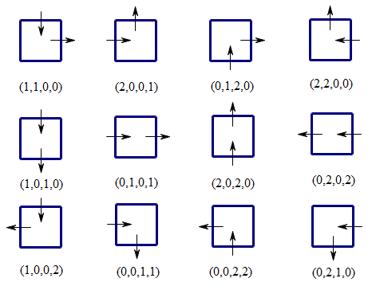

<escape><!-- more --></escape>
    


# Project Euler 393
## 题目
### Migrating ants

An $n\times n$ grid of squares contains $n^2$ ants, one ant per square.

All ants decide to move simultaneously to an adjacent square (usually $4$ possibilities, except for ants on the edge of the grid or at the corners).

We define $f(n)$ to be the number of ways this can happen without any ants ending on the same square and without any two ants crossing the same edge between two squares.

You are given that $f(4) = 88$.

Find $f(10)$.


## 解决方案

本解决方案参考了Thread中的一些内容。

假设$N=10$。那么不难知道，对于每一个方格而言，只有以下$12$种情况，分别表示当前蚂蚁从这个格子从哪个方向走出去，以及哪个方向的蚂蚁将会走进来（用箭头表示方向）：



这$12$种情况分别用一个编码来表示，规则如下：

- 从正上方开始，顺时针表示当前格子的$4$个接触面的状态。
- 如果当前的数字是$0$，那么接触面没有箭头。
- 如果当前的数字是$1$，那么当前的接触面要么是用于向下箭头（上下方向时）或者向右箭头（左右方向时）的一部分。
- 如果当前的数字是$2$，那么当前的接触面要么是用于向上箭头（上下方向时）或者向左箭头（左右方向时）的一部分。

如果两个格子是相邻的，那么在某一种情况下，这两个接触面要么没有任何内容，要么两个格子接触刚刚好拼成一个箭头。

因此，首先通过深度有限搜索，枚举每一行格子的上方状态集合$u$和下方状态集合$d$，并将$u$存在数组$pre[d]$中。

这个状态集合用一个$N$位三进制数$d=d_{N-1}d_{N-2}\dots d_1d_0$来表示。如果第$j$列格子的下方没有箭头，那么$d_j=0$；如果下方是下箭头的一部分，那么$d_j=1$；如果是上箭头的一部分，那么$d_j=2$。

令状态$f(i,j)(0\le i\le N,0\le j\le 3^N)$表示拼接完第$i$行的格子后，第$i$行所有格子的下方的箭头状态集合为$j$的拼接方案数。那么不难写出如下状态转移方程：


$$
f(i,j)=
\left \{\begin{aligned}
  &1  & & \mathrm{if\quad} i=0\wedge j=0 \\
  &0 & & \mathrm{else if\quad} i=0 \\
  &\sum_{st\in pre[j]} f(i-1,st) & & \mathrm{else}
\end{aligned}\right.
$$

注意当$j=0$时，说明第$i$行的格子下方没有任何箭头的一部分。

最终答案为$f(N,0).$

## 代码


```C++
#include <bits/stdc++.h>
typedef long long ll;
using namespace std;
const int N=10;
const int M=pow(3,N);
vector<vector<int>>square{
    {1,1,0,0},{2,0,0,1},{0,1,2,0},{2,2,0,0},
    {1,0,1,0},{0,1,0,1},{2,0,2,0},{0,2,0,2},
    {1,0,0,2},{0,0,1,1},{0,0,2,2},{0,2,1,0}
};
vector<int>g[M];
void dfs(int f,int now,int u,int d){
    if(f==N){
        if(now==0) g[u].push_back(d);
        return;
    }
    for(auto &s:square)
        if(s[3]==now)
            dfs(f+1,s[1],u*3+s[0],d*3+s[2]);
}
ll f[2][M];
int main(){
    dfs(0,0,0,0);
    f[0][0]=1;
    for(int i=0,p=0;i<N;i++,p^=1){
        memset(f[p^1],0,sizeof(f[p^1]));
        for(int u=0;u<M;u++)
            for(int v:g[u])
                f[p^1][v]+=f[p][u];
    }
    printf("%lld\n",f[N&1][0]);
}

```