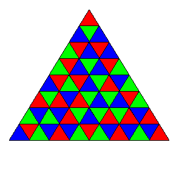

<escape><!-- more --></escape>
    
# Project Euler 189
## 题目
### Tri-colouring a triangular grid

Consider the following configuration of 64 triangles:

We wish to colour the interior of each triangle with one of three colours: red, green or blue, so that no two neighbouring triangles have the same colour. Such a colouring shall be called valid. Here, two triangles are said to be neighbouring if they share an edge.

Note: if they only share a vertex, then they are not neighbours. 

For example, here is a valid colouring of the above grid:

A colouring $C’$ which is obtained from a colouring $C$ by rotation or reflection is considered distinct from $C$ unless the two are identical.

How many distinct valid colourings are there for the above configuration?

## 解决方案

## 代码

