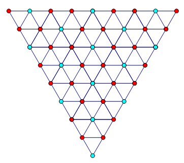
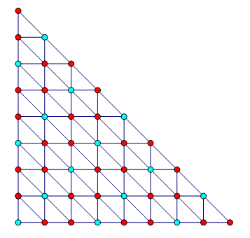

<escape><!-- more --></escape>
    
# Project Euler 202
## 题目
### Laserbeam

Three mirrors are arranged in the shape of an equilateral triangle, with their reflective surfaces pointing inwards. There is an infinitesimal gap at each vertex of the triangle through which a laser beam may pass.

Label the vertices $A, B$ and $C$. There are $2$ ways in which a laser beam may enter vertex $C$, bounce off $11$ surfaces, then exit through the same vertex: one way is shown below; the other is the reverse of that.

There are $80840$ ways in which a laser beam may enter vertex $C$, bounce off $1000001$ surfaces, then exit through the same vertex.

In how many ways can a laser beam enter at vertex $C$, bounce off $12017639147$ surfaces, then exit through the same vertex?

## 解决方案

令$N=12017639147$。处理光线反射问题，最常使用的方法是将整个图形按照镜面对称地拓展开来。这时，处理反射的问题就变成了处理直线的问题。

我们对这个等边三角形进行拓展，得到下图：

其中，蓝色点就是通过镜面拓展出来后的$C$点。

由于这是一个三角形阵列，不容易对每个点进行坐标编排，因此以原图中的点$C$为原点，将整个三角形阵列转化为平面直角坐标系上的点，如下图：

那么很容易地观察出，拓展出来的$C(x,y)$满足关系：$y\equiv x(\mod 3)$

如果光线不会提前射出，那么说明这个光线在经过拓展出来的点之前，是不会经过其它**格点**的。也就是说，$\gcd(x,y)=1$。

另一个观察：如果光线射到一个格点$(x,y)$，那么它实际上被镜子反射$(x-1)+(y-1)+(x+y-1)=2x+2y-3$次。因为他经过了$y-1$条水平的线（镜子），$x-1$条垂直的线，以及$x+y-1$条形如$x+y=k$的直线。

也就是说，现在问题转化为了如下形式：有多少个坐标$(x,y)$，满足

1. $y\equiv x(\mod 3)$
2. $\gcd(x,y)=1$
3. $2x+2y-3=N,$即$x+y=\dfrac{N+3}{2}$
4. $x,y>0$

因此，如果$N$为偶数，那么答案为$0$。

令$M=\dfrac{N+3}{2}$，问题进一步转化成：有多少个数$x$，满足以下条件：

1. $\gcd(x,M-x)=1$，通过辗转相除法，可以改写成$\gcd(x,M)=1$
2. $1\le x\le M$
3. $2x\equiv M(\mod 3)$

不难发现，当$M$是$3$的倍数时，条件1和3是矛盾的，因此此时答案为$0$，因此只考虑$M$为非$3$的倍数时的答案。
## 代码

