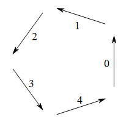
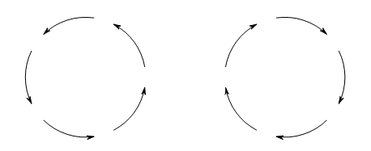

<escape><!-- more --></escape>
    

# Project Euler 208
## 题目
### Robot Walks

A robot moves in a series of one-fifth circular arcs ($72°$), with a free choice of a clockwise or an anticlockwise arc for each step, but no turning on the spot.

One of $70932$ possible closed paths of $25$ arcs starting northward is

Given that the robot starts facing North, how many journeys of $70$ arcs in length can it take that return it, after the final arc, to its starting position?(Any arc may be traversed multiple times.) 

## 解决方案

本方案只适用于$5$的倍数的情况。

假设$m=70,n=\dfrac{m}{5}=14$，那么答案为

$$\sum_{i=0}^n\dfrac{(C_n^i)^5\cdot(n^4-3in^3+4i^2n^2-2ni^3+i^4)}{n^4}$$

如下图所示，当机器人选择了一个方向走，那么下一步它只能选择当前方向的前一个方向或者是后一个方向走。

我们为每个初始方向标上一个序号，按照题意，当前如果行走的是第$i$个方向，那么下一步只能是第$(i+1)\% 5$或者是第$(i-1)\%5$个方向。

可以发现，当机器人恰好沿着这$5$个方向都走一次时，它才能回到原点。因此，在这$m$个步骤中，每个方向出现的次数都是相等的，都为$n$次。

另外，如果这五个方向以逆时针迭代一圈，那就能够下图的左边部分，如果以顺时针迭代一圈，那么就能够得到右边部分。

## 代码

