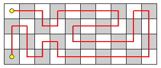

<escape><!-- more --></escape>


# Project Euler 237
## 题目
### Tours on a 4 x n playing board

Let $T(n)$ be the number of tours over a $4 \times n$ playing board such that:

 - The tour starts in the top left corner.
 - The tour consists of moves that are up, down, left, or right one square.
 - The tour visits each square exactly once.
 - The tour ends in the bottom left corner.

The diagram shows one tour over a $4 \times 10$ board:



$T(10)$ is $2329$. What is $T(10^{12}) \text{ modulo } 10^8$?


## 解决方案

两个子问题：

第一个问题：求出关于$4\times n$格子上以$(1,1)$为起点，以$(4,1)$为终点的路径数$T(n)$的关系式。（参考了Thread中的信息。）

使用暴力程序找出前几项后，查找OEIS，发现结果为[A181688](https://oeis.org/A181688)。在FORMULA一栏中，发现如下信息：

```
a(n) = 2*a(n-1) + 2*a(n-2) - 2*a(n-3) + a(n-4), n > 4.
```
再根据前几项枚举出来的值，不难发现$T$的递推公式为：

$$
T(n)=
\left \{\begin{aligned}
  &1  & & \mathrm{if\quad} i\le 2\\
  &4 & & \mathrm{else if\quad} i=3 \\
  &8 & & \mathrm{else if\quad} i=4 \\
  &2T(n-1)+2T(n-2)-2T(n-3)+T(n-4) & & \mathrm{else}
\end{aligned}\right.
$$

证明：令$S(n)$为$4\times n$格子上以$(1,1)$为起点，以$(2,1)$为终点的路径数，令$U(n)$为中间两行的最左边两个格子中，构成一个字母C的路径数（如下图）。

那么有如下三个递推式：

$$\begin{aligned}
S(n) &= S(n-1) + T(n-1)\\
T(n) &= T(n-2) + 2S(n-1) + U(n) \\
U(n) &= 2S(n-2) + U(n-1) 
\end{aligned}$$

对于$S(n)$，一种转移来自$S(n-1)$，一种来自$T(n-1)$，如下面的示意图：

注意到，对于属于$S$的情况，格子$(3,1)$和格子$(4,1)$一定是相连的。对于左边的情况，断裂原本相连的线（如图虚线连线），往左延伸一个格子后再重新连回。右边的情况则是两端直接向后延伸。

第二个问题：优化

上面的递推式需要$O(n)$的时间复杂度才能计算出具体值，因此改用矩阵快速幂，将计算递推式的值的时间复杂度降到$O(\log n)$。将线性递推式写成矩阵相乘的形式：

令矩阵$A$为：

$A=\begin{bmatrix}
2 & 2 & -2 & 1\\
1 & 0 & 0 & 0 \\
0 & 1 & 0 & 0 \\
0 & 0 & 1 & 0
\end{bmatrix}$

那么可以将递推式写成矩阵相乘的形式：

$$
\begin{bmatrix}
T(n)\\
T(n-1)\\
T(n-2)\\
T(n-3)
\end{bmatrix}
=
A
\begin{bmatrix}
T(n-1)\\
T(n-2)\\
T(n-3)\\
T(n-4)
\end{bmatrix}
$$

通过该递推式可以产生矩阵$A$的幂。而矩阵$A$的幂次方$A^n$也可以在对数时间完成计算。因此能以$O(\log n)$的时间复杂度计算$T(n)$的值。


## 代码


```py
N = 10 ** 12
mod = 10 ** 8


def mul(a: list, b: list):
    return [[sum(a[i][k] * b[k][j] for k in range(len(b))) % mod for j in range(len(b[0]))] for i in range(len(a))]


a = [[1, 1, 4, 8]]
b = [[0, 0, 0, 1], [1, 0, 0, -2], [0, 1, 0, 2], [0, 0, 1, 2]]
N -= 1
while N:
    if N & 1:
        a = mul(a, b)
    b = mul(b, b)
    N >>= 1
ans = a[0][0]
print(ans)
# A181688

```