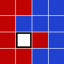

<escape><!-- more --></escape>
    

# Project Euler 244
## 题目
### Sliders

You probably know the game *Fifteen Puzzle*. Here, instead of numbered tiles, we have seven red tiles and eight blue tiles.

A move is denoted by the uppercase initial of the direction (Left, Right, Up, Down) in which the tile is slid, e.g. starting from configuration (**S**), by the sequence **LULUR** we reach the configuration (**E**):

(**S**),(**E**)

For each path, its checksum is calculated by (pseudocode):
$\begin{aligned}
\text{checksum} &= 0\\
\text{checksum} &= (\text{checksum} \times 243 + m_1) \mod 100000007\\
\text{checksum} &= (\text{checksum} \times 243 + m_2) \mod 100000007\\
&\dots&\\
\text{checksum} &= (\text{checksum} \times 243 + m_n) \mod 100000007
\end{aligned}$

where $m_k$ is the ASCII value of the $k^{\text{th}}$ letter in the move sequence and the ASCII values for the moves are:
|||
|-|-|
|**L**|$76$|
|**R**|$82$|
|**U**|$85$|
|**D**|$68$|

For the sequence **LULUR** given above, the checksum would be $19761398$.
Now, starting from configuration (**S**), find all shortest ways to reach configuration (**T**).

(**S**),(**T**)

What is the sum of all checksums for the paths having the minimal length?

## 解决方案

## 代码

