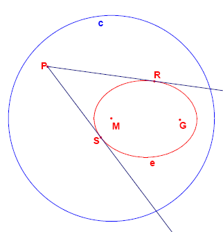

<escape><!-- more --></escape>
    
# Project Euler 246
## 题目
### Tangents to an ellipse

A definition for an ellipse is: 
Given a circle c with centre M and radius r and a point G such that d(G,M)<r, the locus of the points that are equidistant from c and G form an ellipse.

The construction of the points of the ellipse is shown below.

Given are the points M(-2000,1500) and G(8000,1500).  
Given is also the circle c with centre M and radius 15000. 
The locus of the points that are equidistant from G and c form an ellipse e. 
From a point P outside e the two tangents t_1 and t_2 to the ellipse are drawn. 
Let the points where t_1 and t_2 touch the ellipse be R and S.

For how many lattice points P is angle RPS greater than 45 degrees?

# Project Euler 246
## 题目
### Tangents to an ellipse

A definition for an ellipse is:

Given a circle $c$ with centre $M$ and radius $r$ and a point $G$ such that $d(G,M)<r$, the locus of the points that are equidistant from $c$ and $G$ form an ellipse.

The construction of the points of the ellipse is shown below.

Given are the points $M(-2000,1500)$ and $G(8000,1500)$. 

Given is also the circle $c$ with centre $M$ and radius $15000$.

The locus of the points that are equidistant from $G$ and $c$ form an ellipse $e$.

From a point $P$ outside $e$ the two tangents $t_1$ and $t_2$ to the ellipse are drawn.

Let the points where $t_1$ and $t_2$ touch the ellipse be $R$ and $S$.

For how many lattice points $P$ is angle $RPS$ greater than $45$ degrees?

## 解决方案

## 代码

