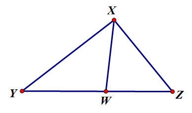

<escape><!-- more --></escape>
    

# Project Euler 257
## 题目
### Angular Bisectors

Given is an integer sided triangle $ABC$ with sides $a \le b \le c.$ $(AB = c, BC = a$ and $AC = b)$.

The angular bisectors of the triangle intersect the sides at points $E, F$ and $G$ (see picture below).

The segments $EF, EG$ and $FG$ partition the triangle $ABC$ into four smaller triangles: $AEG, BFE, CGF$ and $EFG$.

It can be proven that for each of these four triangles the ratio $\text{area}(ABC)/\text{area(subtriangle)}$ is rational.

However, there exist triangles for which some or all of these ratios are integral.

How many triangles $ABC$ with perimeter $\le100,000,000$ exist so that the ratio $\text{area}(ABC)/\text{area}(AEG)$ is integral?

## 引理

如图，假设$XW$是$\triangle XYZ$的一条角平分线，那么满足：$\dfrac{|XY|}{|XZ|}=\dfrac{|WY|}{|WZ|}$。

证明：根据三角形面积公式，可以得到

$\begin{aligned}
S_{\triangle XYW}=\dfrac{1}{2}\cdot |XY|\cdot |XW|\cdot \sin \angle YXW\\
S_{\triangle XZW}=\dfrac{1}{2}\cdot |XZ|\cdot |XW|\cdot \sin \angle ZXW
\end{aligned}$

由于$XW$是$\angle YXZ$的角平分线，因此$\sin \angle YXW=\sin \angle ZXW$。

因此不难得到$\dfrac{S_{\triangle XYW}}{S_{\triangle XZW}}=\dfrac{|XY|}{|XZ|}$。

由于$\triangle XYW,\triangle XZW$等高，并且底相同，因此$\dfrac{S_{\triangle XYW}}{S_{\triangle XZW}}=\dfrac{|WY|}{|WZ|}$

最终得到$\dfrac{|XY|}{|XZ|}=\dfrac{|WY|}{|WZ|}$。

## 解决方案
令$N=10^8$。
不难发现，$S_{\triangle ABC}$和$S_{\triangle AEG}$可以有如下产生方式：$S_{\triangle ABC}=\dfrac{|AC|}{|AG|}\cdot S_{\triangle AGB}=\dfrac{|AC|}{|AG|}\cdot \dfrac{|AB|}{|AE|}\cdot S_{\triangle AEG}$

以$\dfrac{|AC|}{|AG|}$为例。根据引理，有$\dfrac{|AB|}{|CB|}=\dfrac{|AG|}{|CG|}$。根据这个比例，可以得到$\dfrac{|AB|+|CB|}{|CB|}=\dfrac{|AG|+|CG|}{|CG|}$。其中$|AG|+|CG|=|AC|$。

因此最终得到$\dfrac{c+a}{c}=\dfrac{|AC|}{|CG|}$。同理，得到$\dfrac{b+a}{b}=\dfrac{|AB|}{|AE|}$。

那么最终有

$$\dfrac{S_{\triangle ABC}}{S_{\triangle AEG}}=\dfrac{(a+b)(a+c)}{bc}$$

那么最终问题就转化成：有多少个题目中要求的$a,b,c$，使得式子$k=\dfrac{(a+b)(a+c)}{bc}$的值为整数。由于$a\le b\le c$，因此$k\in\{2,3,4\}$。

接下来讨论$k=4,3,2$这$3$种情况。

### $k=4$

不难发现当且仅当$a=b=c$时才满足。这类答案一共有$\left\lfloor\dfrac{N}{3}\right\rfloor$个。

### $k=3$

## 代码

