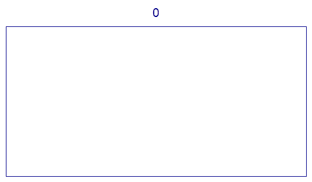

<escape><!-- more --></escape>


# Project Euler 405
## 题目
### A rectangular tiling

We wish to tile a rectangle whose length is twice its width.

Let $T(0)$ be the tiling consisting of a single rectangle.

For $n > 0$, let $T(n)$ be obtained from $T(n-1)$ by replacing all tiles in the following manner:


The following animation demonstrates the tilings $T(n)$ for $n$ from $0$ to $5$:



Let $f(n)$ be the number of points where four tiles meet in $T(n)$.

For example, $f(1) = 0, f(4) = 82$ and $f(10^9) \bmod 17^7 = 126897180$.

Find $f(10^k)$ for $k = 10^{18}$, give your answer modulo $17^7$.


## 解决方案


## 代码


```py
from tools import phi, mod_inverse

K = 10 ** 18
mod = 17 ** 7
ph = phi(mod)
t = pow(10, K, ph)
u = pow(-1, t + 1, mod) - 20 * pow(2, t, mod) + 6 * pow(4, t, mod)
v = mod_inverse(15, mod)
ans = (u * v + 1) % mod
print(ans)

```