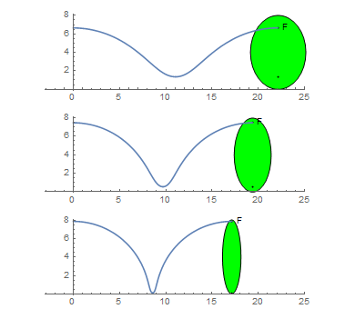

<escape><!-- more --></escape>
    
# Project Euler 525
## 题目
### Rolling Ellipse

An ellipse $E(a, b)$ is given at its initial position by equation:

$$\frac{x^2}{a^2}+\frac{(y-b)^2}{b^2}=1$$

The ellipse rolls without slipping along the x axis for one complete turn. Interestingly, the length of the curve generated by a focus is independent from the size of the minor axis:

$F(a,b)=2\pi \max(a,b)$

This is not true for the curve generated by the ellipse center. Let $C(a,b)$ be the length of the curve generated by the center of the ellipse as it rolls without slipping for one turn.

You are given $C(2, 4) \approx 21.38816906$.

Find $C(1, 4) + C(3, 4)$. Give your answer rounded to $8$ digits behind the decimal point in the form $ab.cdefghij$.

## 解决方案

## 代码

