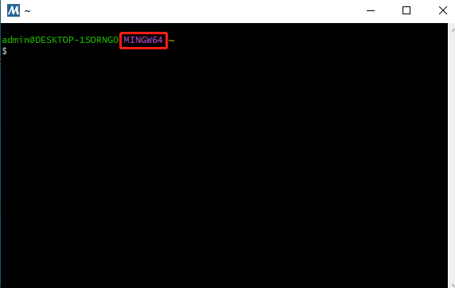

# 下载并安装MSYS2

在[MSYS2官网](https://www.msys2.org/)下载[msys2-x86_64-20220603.exe](https://github.com/msys2/msys2-installer/releases/download/2022-06-03/msys2-x86_64-20220603.exe)，打开并直接完成安装。

如果官网太慢，可以在清华源下载[msys2-x86_64-20220603.exe](https://mirrors.tuna.tsinghua.edu.cn/msys2/distrib/x86_64/msys2-x86_64-20220603.exe)。

我将它安装在了D:\msys64下。

安装完成后会自动打开一个窗口，不用管它。

# 下载GMP库

在[GMP官网](https://gmplib.org/)下载[gmp-6.2.1.tar.xz](https://gmplib.org/download/gmp/gmp-6.2.1.tar.xz)，文件解压后存放在D:\msys64\home\Administrator\gmp-6.2.1中，其中Administrator是用户名。

# 正式安装

打开msys2根目录下的**mingw64.exe**，打开后窗口如下：



注意红框是MINGW64.

如果执行命令时下载速度太慢，可以先参考[这里](https://mirrors.tuna.tsinghua.edu.cn/help/msys2/)将镜像源改成优先使用清华源，注意是**文件开头添加**。

1. 先更新软件源和软件

```bash
pacman -Syu
```

2. 安装如下内容

```bash
pacman -S mingw-w64-x86_64-gcc
pacman -S mingw-w64-x86_64-make
pacman -S mingw-w64-x86_64-libtool
pacman -S autoconf
pacman -S automake
pacman -S mingw-w64-x86_64-python3
pacman -S make
```

3. 跳转到解压后的GMP库的根目录，并进行动态库编译。

这一部分的命令需要执行相当长的时间，电脑约运行了约$5$个小时。
```
 cd gmp-6.2.1/
 ./configure --disable-static --enable-shared
make
make check
make install
```

如果直接使用命令行进行编译，那么编译命令需要添加多一个参数，如下：

```
g++ main.cpp -lgmp
```

Clion使用
```
target_link_libraries(C2 D:\\\\msys64\\\\mingw64\\\\bin\\\\libgmp-10.dll)
```

