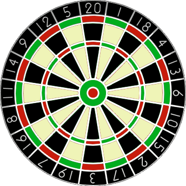

<escape><!-- more --></escape>

# Project Euler 109

## 题目

### Darts

In the game of darts a player throws three darts at a target board which is split into twenty equal sized sections numbered one to twenty.



The score of a dart is determined by the number of the region that the dart lands in. A dart landing outside the red/green outer ring scores zero. The black and cream regions inside this ring represent single scores. However, the red/green outer ring and middle ring score double and treble scores respectively.

At the centre of the board are two concentric circles called the bull region, or bulls-eye. The outer bull is worth $25$ points and the inner bull is a double, worth $50$ points.

There are many variations of rules but in the most popular game the players will begin with a score $301$ or $501$ and the first player to reduce their running total to zero is a winner. However, it is normal to play a “doubles out” system, which means that the player must land a double (including the double bulls-eye at the centre of the board) on their final dart to win; any other dart that would reduce their running total to one or lower means the score for that set of three darts is “bust”.

When a player is able to finish on their current score it is called a “checkout” and the highest checkout is $170$: T20 T20 D25 (two treble 20s and double bull).

There are exactly eleven distinct ways to checkout on a score of $6$:

||||
|-|-|-|
|D3|||
|D1|D2||
|S2|D2||
|D2|D1||
|S4|D1||
|S1|S1|D2|
|S1|T1|D1|
|S1|S3|D1|
|D1|D1|D1|
|D1|S2|D1|
|S2|S2|D1|

Note that D1 D2 is considered **different** to D2 D1 as they finish on different doubles. However, the combination S1 T1 D1 is considered the **same** as T1 S1 D1.

In addition we shall not include misses in considering combinations; for example, D3 is the **same** as 0 D3 and 0 0 D3.

Incredibly there are $42336$ distinct ways of checking out in total.

How many distinct ways can a player checkout with a score less than $100$?

## 解决方案

将所有得分情况全部存在一个列表中。其中前$m$个是双倍得分，其余是三倍得分。

多重循环遍历所有情况即可。需要注意的地方只有判断是不是相同的结分。

## 代码

```py
N = 100
M = 20
a = list(range(2, M * 2 + 2, 2)) + [50]
m = len(a)
a += [25] + list(range(1, M + 1)) + list(range(3, M * 3 + 3, 3))
n = len(a)
ans = 0
for i in range(m):
    if a[i] < N:
        ans += 1
for i in range(n):
    for j in range(m):
        if a[i] + a[j] < N:
            ans += 1
for i in range(n):
    for j in range(i, n):
        for k in range(m):
            if a[i] + a[j] + a[k] < N:
                ans += 1
print(ans)
```
