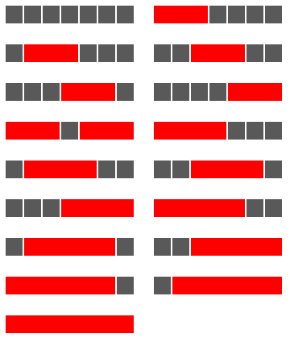

<escape><!-- more --></escape>

# Project Euler 114

## 题目

### Counting block combinations I

A row measuring seven units in length has red blocks with a minimum length of three units placed on it, such that any two red blocks (which are allowed to be different lengths) are separated by at least one grey square. There are exactly seventeen ways of doing this.



How many ways can a row measuring fifty units in length be filled?

NOTE: Although the example above does not lend itself to the possibility, in general it is permitted to mix block sizes. For example, on a row measuring eight units in length you could use red ($3$), black ($1$), and red ($4$).

## 解决方案

本问题的阶段性都很明确，使用动态规划来做。

假设铺成的长度为$n$，红色方块的长度至少为$m(m=3)$，那么分别设状态$f(i),g(i)(0\le i\le n)$为长度$i$的铺设方案中，最后一格为黑色方块/红色方块的铺设方法数量。可以列出$f(i)$和$g(i)$的状态转移方程：

$$
f(i)=
\left \{\begin{aligned}
  &1  & & \mathrm{if\quad} i=0 \\
  &f(i-1)+g(i-1) & & \mathrm{else}
\end{aligned}\right.
$$

$$
g(i)=
\left \{\begin{aligned}
  &0  & & \mathrm{if\quad} i<m \\
  &\sum_{i=0}^{i-m}f(i) & & \mathrm{else}
\end{aligned}\right.
$$

黑色方块长度固定为$1$，放置不受限制，因此直接由两种状态的上一步直接转移。

而红色方块长度至少为$m$，只能放置在黑色方格之后，因此只能从黑色方格处转移过来。另外，红色方格可以有不同的长度，因此，第$i$格可以是长度为$m,m+1,m+2,\dots,i-1,i$的红色方格末尾。

另外需要注意到两个初值：$f(0)=1$，但$g(0)=0$。长度为$0$的情况下起始就只有$1$种方案，因此要么$f(0)=1,g(0)=0$，要么$f(0)=0,g(0)=1$。选择前者的原因：一开始放的方格不受限制，可以是红色，也可以是黑色，而这是“假定”上一个格子为黑色时的特点。

最终答案为$f(n)+g(n)$。

## 代码

```py
N = 50
M = 3
f = [0 for _ in range(N + 1)]
g, s = f.copy(), f.copy()
f[0] = s[0] = 1
for i in range(1, N + 1):
    f[i] = f[i - 1] + g[i - 1]
    if i >= M:
        g[i] = s[i - M]
    s[i] = s[i - 1] + f[i]
ans = f[N] + g[N]
print(ans)

```
