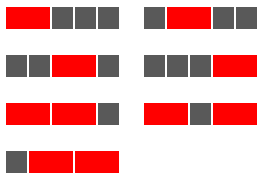

<escape><!-- more --></escape>

# Project Euler 116

## 题目

### Red, green or blue tiles

A row of five black square tiles is to have a number of its tiles replaced with coloured oblong tiles chosen from red (length two), green (length three), or blue (length four).

If red tiles are chosen there are exactly seven ways this can be done.



If green tiles are chosen there are three ways.


And if blue tiles are chosen there are two ways.


Assuming that colours cannot be mixed there are $7 + 3 + 2 = 12$ ways of replacing the black tiles in a row measuring five units in length.

How many different ways can the black tiles in a row measuring fifty units in length be replaced if colours cannot be mixed and at least one coloured tile must be used?

NOTE: This is related to <a href="/Problem101-125/#Problem_117">Problem 117</a>.

## 解决方案

和第115题不一样，这里铺设的方块，不再考虑相邻的时候的问题。

另外，由于不同颜色不能混合使用，因此使用某种单个彩色（红、绿、蓝）的砖块和黑色的砖块一起铺设是独立的问题，应当分开考虑。把分开考虑的结果相加即可。

假设铺成的长度为$n=50$。设$f_m(i)(0\leq i\leq n)$为使用某种长度为$m$的彩色方块和黑色方块一起铺设成长度为$i$的方案数量，可以列出$f_m(i)$的状态转移方程：

$$
f_m(i)=
\left \{\begin{aligned}
  &1  & & \text{if\quad} i<m \\
  &f_m(i-m)+f_m(i-1) & & \text{else}
\end{aligned}\right.
$$

方程的最后一行表示：所有$f_m(i-1)$的方案后面多拼接一个黑色方块；同理，所有$f_m(i-m)$的方案后面都添加一个长度为$m$的彩色方块。

由于题目中规定彩色方块必须使用一次，因此最终答案需要减去全使用黑色方块的方案数。

最终答案为：

$$\sum_{k=2}^4(f_k(n)-1)$$

## 代码

```py
N = 50
M = [2, 3, 4]


def fm(m, n):
    f = [1] * m
    for i in range(m, n+1):
        f.append(f[i - 1] + f[i - m])
    return f[n] - 1


ans = sum(fm(k, N) for k in M)
print(ans)

```
