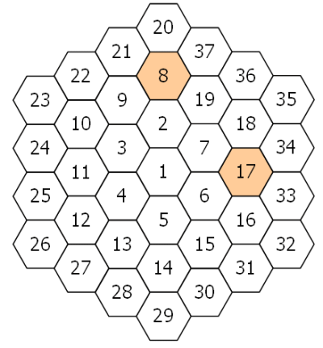

<escape><!-- more --></escape>

# Project Euler 128

## 题目

### Hexagonal tile differences

A hexagonal tile with number $1$ is surrounded by a ring of six hexagonal tiles, starting at "$12$ o'clock" and numbering the tiles $2$ to $7$ in an anti-clockwise direction.

New rings are added in the same fashion, with the next rings being numbered $8$ to $19$, $20$ to $37$, $38$ to $61$, and so on. The diagram below shows the first three rings.



By finding the difference between tile $n$ and each of its six neighbours we shall define $PD(n)$ to be the number of those differences which are prime.

For example, working clockwise around tile $8$ the differences are $12, 29, 11, 6, 1$, and $13$. So $PD(8) = 3$.

In the same way, the differences around tile $17$ are $1, 17, 16, 1, 11$, and $10$, hence $PD(17) = 2$.

It can be shown that the maximum value of $PD(n)$ is $3$.

If all of the tiles for which $PD(n) = 3$ are listed in ascending order to form a sequence, the $10\text{th}$ tile would be $271$.

Find the $2000\text{th}$ tile in this sequence.

## 解决方案

首先需要通过一些证明，跳过完全不需要检查的数。

我们在这里先将每个六边形圈里面的数分成以下几类：

1. 圈的起点（$12$点方向），如$2,8,20$等
2. 圈的终点，如$7,9,37$等
3. 圈的边节点（不包括终点），如$9,11,13,15,17,33,34$等
4. 圈的$4,8$点方向的两个角节点，如$6,16,32,4,12,26$等。
5. 圈的$2,6,10$点方向的三个角节点，如$7,18,35,5,14,29,3,10,23$等。

可以发现，随着圈数的上升，起点数和终点数以及角节点是线性增长的，而圈的边节点是平方增长的。

说明圈第三类节点不可能是我们需要的（以$13$为例）：这些边节点和内圈相邻$2$个节点（$4,5$），外圈相邻$2$个节点（$27,28$），前后相接一个节点（$12,14$）。前后相接的节点差值为$1$，不是质数；和内圈相邻的两个节点，它们也是相邻的，故肯定存在一个节点和本节点同奇偶；外圈同理。因此，第三类节点至少有$4$个相邻差不是质数，故排除。

说明第四类节点不可能是我们需要的（以$16$为例）：这些角节点和内圈相邻$1$个节点（$6$），外圈相邻$3$个节点（$31,32,33$），前后相接一个节点（$15,17$）。前后相接的节点差值为$1$，不是质数；从内向外（除了$1$），这两个方向的节点，从内向外把数列出来，都是偶数。因此，它和相邻的两个同方向角节点($6,32$)是同奇偶的。因此，第五类节点至少有$4$个相邻差不是质数，故排除。

说明第五类节点不可能是我们需要的（以$18$为例）：这些角节点和内圈相邻$1$个节点（$7$），外圈相邻$3$个节点（$34,35,36$），前后相接一个节点（$17,19$）。前后相接的节点差值为$1$，不是质数；从内向外（除了$1$），这两个方向的节点，从内向外把数列出来，都是奇偶相间的。因此，它和外圈的另外两个边节点($34,36$)一定是同奇偶的。因此，第五类节点至少有$4$个相邻差不是质数，故排除。

因此，只需要枚举每个圈的起点和终点即可。

枚举起点时需要注意的地方：不需要枚举$8$点钟方向的节点（差值肯定为$1$），以及$6,12$点钟方向的数（差值肯定是$6$的倍数）。

枚举终点时需要注意的地方：不需要枚举$4$点钟方向的节点（差值肯定为$1$），以及$6,12$点钟方向的数（差值肯定是$6$的倍数）

## 代码

```py
from itertools import count
from tools import is_prime

Q = 2000
ls = [1, 2]
for n in count(2, 1):
    # 起点
    a = 6 * n + 1  # 10
    b = 12 * n + 5  # 2
    c = 6 * n - 1  # 4
    st = 3 * n * n - 3 * n + 2
    if is_prime(a) and is_prime(b) and is_prime(c):
        ls.append(st)
    # 终点
    a = 6 * n - 1  # 10
    b = 12 * n - 7  # 8
    c = 6 * n + 5  # 2
    ed = 3 * n * n + 3 * n + 1
    if is_prime(a) and is_prime(b) and is_prime(c):
        ls.append(ed)
    if len(ls) >= Q:
        break
ans = ls[Q - 1]
print(ans)
```
