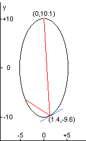

<escape><!-- more --></escape>

# Project Euler 144

## 题目

### Investigating multiple reflections of a laser beam

In laser physics, a “white cell” is a mirror system that acts as a delay line for the laser beam. The beam enters the cell, bounces around on the mirrors, and eventually works its way back out.

The specific white cell we will be considering is an ellipse with the equation $4x^2 + y^2 = 100$
The section corresponding to $-0.01 \leq x \leq +0.01$ at the top is missing, allowing the light to enter and exit through the hole.

 

The light beam in this problem starts at the point $(0.0,10.1)$ just outside the white cell, and the beam first impacts the mirror at $(1.4,-9.6)$.

Each time the laser beam hits the surface of the ellipse, it follows the usual law of reflection “angle of incidence equals angle of reflection.” That is, both the incident and reflected beams make the same angle with the normal line at the point of incidence.

In the figure on the left, the red line shows the first two points of contact between the laser beam and the wall of the white cell; the blue line shows the line tangent to the ellipse at the point of incidence of the first bounce.

The slope $m$ of the tangent line at any point $(x,y)$ of the given ellipse is: $m = -4x/y$

The normal line is perpendicular to this tangent line at the point of incidence.

The animation on the right shows the first $10$ reflections of the beam.

How many times does the beam hit the internal surface of the white cell before exiting?

## 解决方案

本问题分成两个子问题解决。

第一个是已知两条直线$l_1:y=ax+b_1,l_2:y=mx+b_2$，求$l_1$关于$l_2$对称的直线。其中，已知它们的交点$l_1\cap l_2=(x_0,y_0)$.

那么现在只剩下求斜率的问题，可以参考下图。


假设需要求的那条线$l_3$的斜率为$k$。根据对称的定义，明显$\theta_1$和$\theta_2$这两个角的大小是相等的。那么使用$\tan$的差角公式，可以得到以下式子：

$$\dfrac{m-k}{1+mk}=\dfrac{a-m}{1+am}$$

解得$k=\dfrac{am^2+2m-a}{1+2am-m^2}$

明显的是，$(x_0,y_0)$也在$l_3$上，故$l_3$的方程可以确定为$y=k(x-x_0)+y_0$.

回到本题，入射的光线明显属于$l_1$，而$(x_0,y_0)$在椭圆上的切线就是$l_2$。所求反射光线即为$l_3$。

第二个问题是求反射直线到达的椭圆上的点。

设求出来的$l_3:y=kx+b$，联立两个方程：

$$\left \{\begin{aligned}
  & y=kx+b\\
  & 4x^2+y^2=100
\end{aligned}\right.
$$

消去$y$，得到关于$x$的一元二次方程：

$$(k^2+4)x^2+2bkx+b^2-100=0$$

因此，计算出判别式$\Delta=16(25k^2+100-b^2)$，直接套用求根公式可以求出两个解$x_0,x'$

需要注意的是，由于$(x_0,y_0)$是属于$l_3$中的点，因此解一定会出现$x_0$。取另外一个解$x'$，计算出$y'=kx'+b'$，那么$(x',y')$就是反射光线射中的点。

因此，解决了上面两个问题之后，每一次迭代都找出反射光射中的点。如果射中的是缺口，那么跳出循环。

## 代码

```py
x1, y1, x2, y2 = 0.0, 10.1, 1.4, -9.6
def solve(x1, y1, x2, y2):
    cnt = 1
    x, y = x2, y2
    k = (y2 - y1) / (x2 - x1)
    while True:
        m = y / (4 * x)
        # 第一个问题
        k = (2 * m - k * (1 - m ** 2)) / (1 - m ** 2 + 2 * m * k)
        b = y - k * x
        # 第二个问题
        x1 = (-2 * k * b + 4 * (25 * k ** 2 + 100 - b ** 2) ** 0.5) / (2 * (4 + k ** 2))
        x2 = (-2 * k * b - 4 * (25 * k ** 2 + 100 - b ** 2) ** 0.5) / (2 * (4 + k ** 2))
        if abs(x1 - x) < 1e-7:
            x, y = x2, k * x2 + b
        else:
            x, y = x1, k * x1 + b
        if abs(x) < 1e-2 and y >= 0:
            break
        cnt += 1
    return cnt


ans = solve(0.0, 10.1, 1.4, -9.6)
print(ans)

```
