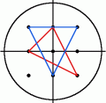

<escape><!-- more --></escape>

# Project Euler 184

## 题目

### Triangles containing the origin

Consider the set $I_r$ of points $(x,y)$ with integer co-ordinates in the interior of the circle with radius $r$, centered at the origin, i.e. $x^2 + y^2 < r^2$.

For a radius of $2$, $I_2$ contains the nine points $(0,0), (1,0), (1,1), (0,1), (-1,1), (-1,0), (-1,-1), (0,-1)$ and $(1,-1)$. There are eight triangles having all three vertices in $I_2$ which contain the origin in the interior. Two of them are shown below, the others are obtained from these by rotation.



For a radius of $3$, there are $360$ triangles containing the origin in the interior and having all vertices in $I_3$ and for $I_5$ the number is $10600$.

How many triangles are there containing the origin in the interior and having all three vertices in $I_{105}$?

## 解决方案

令$N=105$，考虑在$x$轴上方以及$x$周的正半轴所有点$(x,y)$（对这些点更形式化的定义：$0<x^2+y^2<N^2,y>0\vee y=0\wedge x>0$），按照极角统计这些点的数量。

对于上半部分的这一些点，随机选择三个极角**两两不相同**的点，它们都能够对应$2$个原点$O$在内部的三角形，如下图：


按照极角从小到大分别表示$A,B,C$三个点（其极角分别为$\alpha.\beta,\gamma$），有两种情况：

- 极角在中间的点$B$在$x$轴上面，极角在两侧的点$A,C$的中心对称点$A',C'$在$x$轴下面。
- 极角在中间的点$B$的中心对称点$B'$在$x$轴下面，极角在两侧的点$A,C$在$x$轴上面。

令$g(k)$表示上述极角为$k$的个数。令$s_r=\sum_k g^r(k)$，那么本题答案为$\dfrac{s_1^3-3s_1s_2+2s_3}{3}$。

计算过程使用了容斥原理的思想，如下：

一开始，顺序随机选定$A,B,C$三个点（不考虑极角顺序），有$s_1^3$种选择方法。然后，需要去掉三个点中有两个极角相同的情况，需要去掉$3s_1s_2$种选法。但是，三个点都在同一极角的情况又多减去了$2$次，因此需要添加回$2s_3$。由于$A,B,C$三个点选择方法本身是无序的，因此整个选择方法需要除$3!$。每一种选法都对应两个原点在内部的三角形，需要乘回$2$。因此本题的最终结果为：

$$\dfrac{s_1^3-3s_1s_2+2s_3}{3}$$

（$O(\log R)$甚至是亚线性做法待补）

## 代码

```py
from fractions import Fraction

N = 6

slopes_dict = {}

nb_of_points = 0
for i in range(0, N):
    for j in range(1, N):
        w = i * i + j * j
        if i * i + j * j < N * N:
            nb_of_points += 1
            if i != 0 and j != 0:
                s = Fraction(j, i)
                if s in slopes_dict.keys():
                    slopes_dict[s] += 1
                else:
                    slopes_dict[s] = 1
slopes_dict[0] = N - 1

ls = list(slopes_dict.values()) * 2
s1 = sum(ls)
s2 = sum(x * x for x in ls)
s3 = sum(x ** 3 for x in ls)
ans = (s1 ** 3 - 3 * s1 * s2 + 2 * s3) // 3
print(ans)

```
