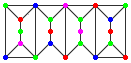

<escape><!-- more --></escape>

# Project Euler 194

## 题目

### Coloured Configurations

Consider graphs built with the units A:  and B: , where the units are glued along the vertical edges as in the graph .

A configuration of type $(a,b,c)$ is a graph thus built of $a$ units A and $b$ units B, where the graph’s vertices are coloured using up to $c$ colours, so that no two adjacent vertices have the same colour.

The compound graph above is an example of a configuration of type $(2,2,6)$, in fact of type $(2,2,c)$ for all $c \ge 4$.

Let $N(a,b,c)$ be the number of configurations of type $(a,b,c)$.

For example, $N(1,0,3) = 24, N(0,2,4) = 92928$ and $N(2,2,3) = 20736$.

Find the last $8$ digits of $N(25,75,1984)$.

## 删除-收缩公式

[删除-收缩公式](https://en.wikipedia.org/wiki/Deletion%E2%80%93contraction_formula)用于将描述无向图$G=(V,E)$的任意函数$f$转化成递归的形式：

$$f(G)=f(G\setminus e)+f(G/e)$$

其中，边$e\in E$是图$G$的任意一遍。$\setminus$运算是将边$e$从$E$中删去，而$/$运算则是将边$e$的两个端点$(u,v)$合并成一个新点$w$，其它之前和$u,v$分别关联的边都关联到$w$上。

## 色多项式

[色多项式](https://en.wikipedia.org/wiki/Chromatic_polynomial)$P(G,x)$，表示一个无向图$G=(V,E)$用$x$种颜色进行着色的方案数量，其中相邻两点颜色不同。这个多项式有以下特点：

- 最高次数为$|V|$
- 最高次数的项系数为$1$
- 所有项的系数都为整数

可以利用删除-收缩公式递归地求解该色多项式$P(G,x)$。不难发现，当一个图$G$没有任何边时，$P(G,x)=x^{|V|}$，这也是删除-收缩公式的递归终点。

## 解决方案

通过暴力地对上面的删除-收缩公式进行迭代，可以得到两个单元的色多项式分别为：

$$P(A,x)=x^7-10x^6+ 43 x^5-103 x^4+146x^3-115x^2+38x$$

$$P(B,x)=x^7-9x^6+ 35 x^5-77 x^4+102x^3-76x^2+24x$$

假设$a=25$为单元$A$的个数，$b=75$为单元$B$的个数，$c=1984$为拥有的彩色种数，那么答案为：

$$\dfrac{C_{a+b}^aP^a(A,c)P^b(B,c)}{(c(c-1))^{a+b-1}}$$

注意到两个相邻单元之间染色的点是合在一起的，因此需要除回$c(c-1)$。

## 代码

```py
from tools import C

A = 25
B = 75
C = 1984
mod = 10 ** 8
pA = C ** 7 - 10 * C ** 6 + 43 * C ** 5 - 103 * C ** 4 + 146 * C ** 3 - 115 * C ** 2 + 38 * C
pB = C ** 7 - 9 * C ** 6 + 35 * C ** 5 - 77 * C ** 4 + 102 * C ** 3 - 76 * C ** 2 + 24 * C
ans = C(A + B, B) * pow(pA, A) * pow(pB, B) // (C * (C - 1)) ** (A + B - 1) % mod
print(ans)

```
