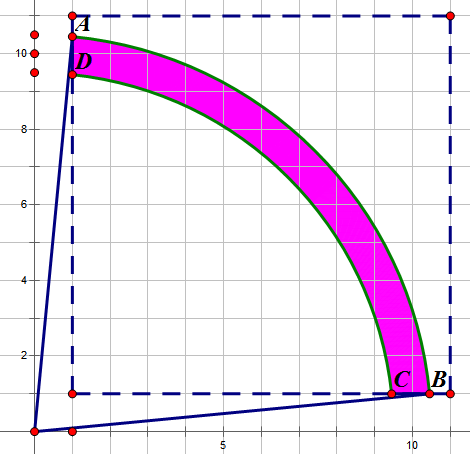

<escape><!-- more --></escape>

# Project Euler 285

## 题目

### Pythagorean odds

Albert chooses a positive integer $k$, then two real numbers $a, b$ are randomly chosen in the interval $[0,1]$ with uniform distribution.

The square root of the sum $(k\cdot a+1)^2 + (k\cdot b+1)^2$ is then computed and rounded to the nearest integer. If the result is equal to $k$, he scores $k$ points; otherwise he scores nothing.

For example, if $k = 6, a = 0.2$ and $b = 0.85$, then $(k\cdot a+1)^2 + (k\cdot b+1)^2 = 42.05$.

The square root of $42.05$ is $6.484\dots$ and when rounded to the nearest integer, it becomes $6$.

This is equal to $k$, so he scores $6$ points.

It can be shown that if he plays $10$ turns with $k = 1, k = 2, …, k = 10$, the expected value of his total score, rounded to five decimal places, is $10.20914$.

If he plays $10^5$ turns with $k = 1, k = 2, k = 3, …, k = 10^5$, what is the expected value of his total score, rounded to five decimal places?

## 解决方案

用数形结合的方法解决本问题。



如果$a,b$分别是从$[0,1]$中均匀选择的，那么令$x=ka+1,y=kb+1$，可以表示成一个点将在如图所示的正方形$(1,1)-(k+1,k+1)$中选。

在原点画一个半径为$k$的圆。可以发现，如果最终$\sqrt{x^2+y^2}$可以四舍五入到$k$，那么$|\sqrt{x^2+y^2}-k|\leq \dfrac{1}{2}$，因此，画两个半径为$k+\dfrac{1}{2}$和$k-\dfrac{1}{2}$。只要在这两个圆之间的所有点，都满足这个条件。

因此，游戏成功的概率就为该上图中阴影面积占整个正方形选择区域的面积比率。

每一场游戏都是独立的，计算出结果相加即可。

需要注意当$k=1$时，这两个圆的内圆和正方形不相交。

## 代码

```Python
from math import asin, cos, pi


# 计算整块在正方形内部的图形面积
def cal(r: float):
    sinT = 1 / r
    T = asin(sinT)
    A = pi / 2 - 2 * T
    # 扇形面积
    all_area = A * r * r / 2
    return all_area - 0.5 * (r * cos(T) - 1) * 1 * 2


N = 10 ** 5
# 当k = 1时，特殊处理。
ans = cal(1 + 0.5) / (1 ** 2) * 1
for k in range(2, N + 1):
    ans += (cal(k + 0.5) - cal(k - 0.5)) / (k ** 2) * k
print("{:.5f}".format(ans))

```
