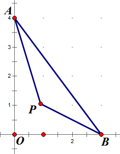

<escape><!-- more --></escape>


# Project Euler 613

## 题目

### Pythagorean Ant


Dave is doing his homework on the balcony and, preparing a presentation about Pythagorean triangles, has just cut out a triangle with side lengths 30cm, 40cm and 50cm from some cardboard, when a gust of wind blows the triangle down into the garden.
Another gust blows a small ant straight onto this triangle. The poor ant is completely disoriented and starts to crawl straight ahead in random direction in order to get back into the grass.

Assuming that all possible positions of the ant within the triangle and all possible directions of moving on are equiprobable, what is the probability that the ant leaves the triangle along its longest side?
Give your answer rounded to 10 digits after the decimal point.

## 解决方案

建立一个$Rt\triangle AOB$，其中$A(0,y_0),B(x_0,0)$。



假设$Rt\triangle ABC$内任意一点$P(x,y)$，那么从$P$移动到最长边的概率为$\angle APB$占整个$2\pi$的比率。通过向量内积，可以直接计算出这个比率的值：

$$p(x,y)=\frac{1}{2\pi}\cos^{-1} \frac{x^2+y^2-xx_0-yy_0}{\sqrt{(x_0-x)^2+y^2}\cdot\sqrt{x^2+(y_0-y)^2}}$$

那么，根据题意，可以直接计算以下二重积分的值：

$$I=\int_0^{x_0}\int_0^{y_0-\frac{y_0}{x_0}}p(x,y)dydx$$

并将三角形的面积归一化，最终答案为：

$$P=\frac{2}{x_0y_0}I$$

## 代码

```Python
from math import acos, pi
from scipy.integrate import dblquad

x0 = 30
y0 = 40

ans, err = dblquad(
    lambda y, x: acos((x * x + y * y - x * x0 - y * y0) 
    / ((x0 - x) ** 2 + y ** 2) ** 0.5 / ((y0 - y) ** 2 + x ** 2) ** 0.5) / (2 * pi),
    # y的上下限
    0, x0,
    # x的上下限
    0, lambda x: y0 - y0 / x0 * x)
ans /= x0 * y0 / 2
print("{:.10f}".format(ans))
# 答案是1/2-(a/4pib)*log((a^2+b^2)/a^2)-(b/4pia)*log((a^2+b^2)/b^2)
```