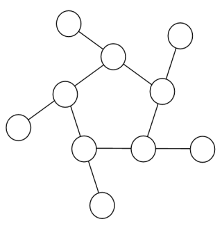
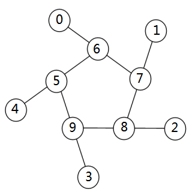

<escape><!-- more --></escape>

# Project Euler 68

## 题目

### Magic 5-gon ring

Consider the following “magic” $3$-gon ring, filled with the numbers $1$ to $6$, and each line adding to nine.


Working **clockwise**, and starting from the group of three with the numerically lowest external node ($4,3,2$ in this example), each solution can be described uniquely. For example, the above solution can be described by the set: $4,3,2; 6,2,1; 5,1,3$.

It is possible to complete the ring with four different totals: $9, 10, 11$, and $12$. There are eight solutions in total.

|Total|Solution Set|
|-|-|
|$9$|$4,2,3; 5,3,1; 6,1,2$|
|$9$|$4,3,2; 6,2,1; 5,1,3$|
|$10$|$2,3,5; 4,5,1; 6,1,3$|
|$10$|$2,5,3; 6,3,1; 4,1,5$|
|$11$|$1,4,6; 3,6,2; 5,2,4$|
|$11$|$1,6,4; 5,4,2; 3,2,6$|
|$12$|$1,5,6; 2,6,4; 3,4,5$|
|$12$|$1,6,5; 3,5,4; 2,4,6$|

By concatenating each group it is possible to form $9$-digit strings; the maximum string for a $3$-gon ring is $432621513$.

Using the numbers $1$ to $10$, and depending on arrangements, it is possible to form $16$- and $17$-digit strings. What is the maximum **$16$-digit** string for a “magic” $5$-gon ring?



## 解决方案

为每个圈进行编号：



其中，外圈用$0\sim 4$标记，内圈用$5\sim9$来标记。

由于输出的是$16$位数，因此枚举过程中需要排除$10$在内圈的情况。

最终，枚举全排列，一个个进行判断。

## 代码

```py
from itertools import permutations

a = [1, 2, 3, 4, 5, 6, 7, 8, 9, 10]
ans = 0
for a in permutations(a):
    # 外圈最小的在首个，因此确保最小的下标是在0。
    # 输出值只能有16位数，因此10只能在外圈。
    if min(a[0:5]) != a[0] or 10 in a[5:10]:
        continue
    if a[0] + a[6] + a[7] == a[1] + a[7] + a[8] == a[2] + a[8] + a[9] == a[3] + a[9] + a[5] == a[4] + a[5] + a[6]:
        s = [str(x) for x in a]
        t = s[0] + s[6] + s[7] + s[1] + s[7] + s[8] + s[2] + s[8] + s[9] + s[3] + s[9] + s[5] + s[4] + s[5] + s[6]
        ans = max(ans, int(t))
print(ans)
```
