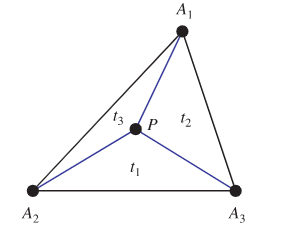

<escape><!-- more --></escape>

# Project Euler 727

## 题目

### Triangle of Circular Arcs

Let $r_a$, $r_b$ and $r_c$ be the radii of three circles that are mutually and externally tangent to each other. The three circles then form a *triangle of circular arcs* between their tangency points as shown for the three blue circles in the picture below.


Define the circumcircle of this triangle to be the red circle, with centre $D$, passing through their tangency points. Further define the incircle of this triangle to be the green circle, with centre $E$, that is mutually and externally tangent to all the three blue circles. Let $d=\vert DE \vert$ be the distance between the centres of the circumcircle and the incircle.

Let $\mathbb{E}(d)$ be the expected value of $d$ when $r_a$, $r_b$ and $r_c$ are integers chosen uniformly such that $1\leq r_a<r_b<r_c \le 100$ and $\text{gcd}(r_a,r_b,r_c)=1$.

Find $\mathbb{E}(d)$, rounded to eight places after the decimal point.

## 重心坐标(Barycentric coordinates)

[重心坐标](https://mathworld.wolfram.com/BarycentricCoordinates.html)，表示三角形中的三个顶点的一组“质量”$(t_1,t_2,t_3)$，这三个质量可以唯一确定这个点在平面中的位置。为了规范化，一般令这三个值满足$t_1+t_2+t_3=1$。



可以看出，顶点在这个坐标系下的坐标有：$A_1(1,0,0),A_2(0,1,0),A_3(0,0,1)$

## 解决方案

在$\triangle ABC$中，点$D$是其内心。

点$E$是$\odot A,\odot B,\odot C$的内索蒂圆圆心，也叫做$\triangle ABC$的[Equal Detour Point](https://mathworld.wolfram.com/EqualDetourPoint.html).

三角形内部点$E$的位置满足：$|AE|+|BE|-|AB|=|AE|+|CE|-|AC|=|BE|+|CE|-|BC|$。

设$|BC|=a,|AC|=b,|AB|=c$，那么点$D$重心坐标为$D(a,b,c)$。

点$E$的[重心坐标](https://en.wikipedia.org/wiki/Equal_detour_point)为$E\left(a+{\dfrac {\Delta }{s-a}},b+{\dfrac {\Delta }{s-b}},c+{\dfrac {\Delta }{s-c}}\right)$，其中，$\Delta$是三角形的面积，$s$三角形的半周长。

假设**规范化**后的两点坐标为$P(x_1,y_1,z_1),Q(x_2,y_2,z_2)$，令$x=x_2-x_1,y=y_2-y_1,z=z_2-z_1$，那么$\overrightarrow {PQ}=(x,y,z)$。

[重心坐标系两点距离公式](https://en.wikipedia.org/wiki/Barycentric_coordinate_system#Distance_between_points)为：$d^2=|\overrightarrow {PQ}|=-a^2yz-b^2zx-c^2xy$。直接使用此公式即可计算$|DE|$的值。

## 代码

```C++
# include <bits/stdc++.h>
# define mem(a,b) memset(a,b,sizeof(a))
using namespace std;
typedef long long ll;
const int N=100;

tuple<double,double,double> normalize(tuple<double,double,double> P){
    double s=get<0>(P)+get<1>(P)+get<2>(P);
    return make_tuple(get<0>(P)/s,get<1>(P)/s,get<2>(P)/s);
}
/*
D: 内心
E：Equal detour point，三角形内一点P满足|AP|+|BP|-|AB|=|AP|+|CP|-|AC|=|BP|+|CP|-|BC|
在重心坐标系下表示。
重心坐标系下两点距离计算向量PQ的长度|PQ|：|PQ|^2=-a^2yz-b^2zx-c^2xy
*/
int main(){
    double ans=0,a1,b1,c1,a2,b2,c2;
    int cnt=0;
    for(int ra=1;ra<=N;ra++)
    for(int rb=ra+1;rb<=N;rb++){
        int g=__gcd(ra,rb);
        for(int rc=rb+1;rc<=N;rc++){
            if(__gcd(g,rc)!=1) continue;
            double a=ra+rb,b=rb+rc,c=rc+ra;
            double p=(a+b+c)*0.5;
            double S=sqrt(p*(p-a)*(p-b)*(p-c));
            auto D=make_tuple(a,b,c);
            auto E=make_tuple(a+S/(p-a),b+S/(p-b),c+S/(p-c));
            tie(a1,b1,c1)=normalize(D);
            tie(a2,b2,c2)=normalize(E);
            double x=a2-a1,y=b2-b1,z=c2-c1;
            double de2=-a*a*y*z-b*b*z*x-c*c*x*y;
            ++cnt;
            ans+=sqrt(de2);
        }
    }
    ans/=cnt;
    printf("%.8f\n",ans);
}
```
