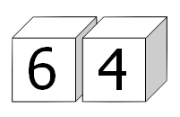

<escape><!-- more --></escape>

# Project Euler 90

## 题目

### Cube digit pairs

Each of the six faces on a cube has a different digit ($0$ to $9$) written on it; the same is done to a second cube. By placing the two cubes side-by-side in different positions we can form a variety of $2$-digit numbers.
For example, the square number $64$ could be formed:



In fact, by carefully choosing the digits on both cubes it is possible to display all of the square numbers below one-hundred: $01, 04, 09, 16, 25, 36, 49, 64$, and $81$.

For example, one way this can be achieved is by placing $\{0, 5, 6, 7, 8, 9\}$ on one cube and $\{1, 2, 3, 4, 8, 9\}$ on the other cube.

However, for this problem we shall allow the $6$ or $9$ to be turned upside-down so that an arrangement like $\{0, 5, 6, 7, 8, 9\}$ and $\{1, 2, 3, 4, 6, 7\}$ allows for all nine square numbers to be displayed; otherwise it would be impossible to obtain $09$.

In determining a distinct arrangement we are interested in the digits on each cube, not the order.

$\{1, 2, 3, 4, 5, 6\}$ is equivalent to $\{3, 6, 4, 1, 2, 5\}$
$\{1, 2, 3, 4, 5, 6\}$ is distinct from $\{1, 2, 3, 4, 5, 9\}$

But because we are allowing $6$ and $9$ to be reversed, the two distinct sets in the last example both represent the extended set $\{1, 2, 3, 4, 5, 6, 9\}$ for the purpose of forming $2$-digit numbers.

How many distinct arrangements of the two cubes allow for all of the square numbers to be displayed?

## 解决方案

每个盒子一共有$C_{10}^6=210$种情况可以填数。两个盒子一起则有$\dfrac{210\times(210+1)}{2}=22155$种。

此处使用itertools库的combinations产生所有组合。

枚举所有的组合，然后判断平方数中的两个位是否分别在两个集合中。

## 代码

```py
from itertools import combinations

x, y = [0, 0, 0, 1, 2, 3, 4, 6, 8], [1, 4, 9, 6, 5, 6, 9, 4, 1]
ls = []
for s in combinations([0, 1, 2, 3, 4, 5, 6, 7, 8, 9], 6):
    st = set(s)
    if 6 in st or 9 in st:
        st.add(6)
        st.add(9)
    ls.append(st)

ans = 0
for i in range(len(ls)):
    for j in range(i, len(ls)):
        sa, sb = ls[i], ls[j]
        ok = True
        for k in range(9):
            if not (x[k] in sa and y[k] in sb or x[k] in sb and y[k] in sa):
                ok = False
                break
        ans += ok
print(ans)

```
