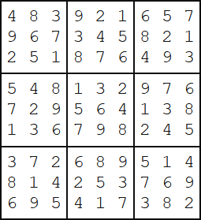

<escape><!-- more --></escape>

# Project Euler 96

## 题目

### Su Doku

Su Doku (Japanese meaning number place) is the name given to a popular puzzle concept. Its origin is unclear, but credit must be attributed to Leonhard Euler who invented a similar, and much more difficult, puzzle idea called Latin Squares. The objective of Su Doku puzzles, however, is to replace the blanks (or zeros) in a $9$ by $9$ grid in such that each row, column, and $3$ by $3$ box contains each of the digits $1$ to $9$. Below is an example of a typical starting puzzle grid and its solution grid.

  

A well constructed Su Doku puzzle has a unique solution and can be solved by logic, although it may be necessary to employ “guess and test” methods in order to eliminate options (there is much contested opinion over this). The complexity of the search determines the difficulty of the puzzle; the example above is considered easy because it can be solved by straight forward direct deduction.

The 6K text file, [sudoku.txt](../resources/p096_sudoku.txt) (right click and ‘Save Link/Target As…’), contains fifty different Su Doku puzzles ranging in difficulty, but all with unique solutions (the first puzzle in the file is the example above).

By solving all fifty puzzles find the sum of the 3-digit numbers found in the top left corner of each solution grid; for example, 483 is the 3-digit number found in the top left corner of the solution grid above.

## 解决方案

本代码主要采用深度优先搜索解决：每次尝试寻找一个格子并填充，然后判断是否合法。

使用的加速优化手段如下：

1. 使用位运算。每行/列/宫格都有一个$9$比特编码，用来表示该行/列/宫格有哪些数字已经用了。
2. 每次填数时，寻找当前可填数最少的格子进行填数。这能够确保如果一个格子没有数填了，就及时返回。
3. 使用lowbit。将与运算获得填数的候选值，通过lowbit可以直接取出，不需要再用一个for循环遍历9个比特。

此处提及一下[Dancing Links](https://en.wikipedia.org/wiki/Dancing_Links)算法，一个专门解决精准覆盖问题的算法，如本问题数独游戏。

## 代码

```C++
# include <bits/stdc++.h>
# define lb(x) (x & -x)
using namespace std;
int r[10], c[10], p[10], lg2[604], cnt_bit[604], cnt = 0,INF = 0x3f3f3f3f;
//r,c,p分别表示对应行/列/宫格中，数的使用情况。
inline void get(int & R, int & C, int & P, int i) { R=i/9,C=i%9,P=R/3*3+C/3;}
inline void op(int R, int C, int P, int z)
{
    r[R]^=1<<z;c[C]^=1<<z;p[P]^=1<<z;
}
void init() { for(int i=0;i<10; i++) r[i]=c[i]=p[i]=(1<<9)-1; cnt=0; }
char s[100];
bool dfs(int cnt)
{
    if (!cnt) return 1;
    int R,C,P,k=INF,v=0;
    for (int i=0;s[i];i++)
        if (s[i]=='0')
        {
            get(R,C,P,i);
            int t=r[R]&c[C]&p[P];
            if (!t) return 0;
            if (cnt_bit[t] < k)v=i, k=cnt_bit[t];
        }
    get(R,C,P,v);
    k=r[R]&c[C]&p[P];
    while (k)
    {
        int x=lg2[lb(k)];
        s[v]=x+'1';
        op(R,C,P,x);
        if (dfs(cnt-1)) return 1;
        s[v] = '0';
        op(R,C,P,x);
        k-=lb(k);
    }
    return 0;
}
int main(){
    freopen("p096_sudoku.txt","r",stdin);
    int R, C, P;
    for (int i=0;i<=8;i++) lg2[1 << i]=i;
    for (int i=0;i<600;i++)
    {
        int t=i;
        while(t)t-=lb(t),cnt_bit[i]++;
    }
    int ans=0;
    while(~scanf("%s %s",s,s)){
        init();
        // 输入的数独直接以一个81字节的一维数组存储。
        for(int i=0,off_set=0; i < 9; i++, off_set+=9)
            scanf("%s", s + off_set);
        for(int i=0;s[i];i++)
        {
            if (s[i]!='0')
            {
                get(R,C,P,i);
                op(R,C,P,s[i]-'1');
            }
            else cnt++;
        }
        dfs(cnt);
        ans+=100*(s[0]-'0');
        ans+=10*(s[1]-'0');
        ans+=s[2]-'0';
    }
    printf("%d\n",ans);
}
```
